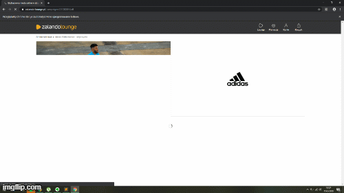

# Shopping Bot
I build a simple bot that can add items to a shopping chart. If you want to book them before other people will add them to theirs shoping charts, this program shows how these bots work!
This programm only shows how you can build Zalando Bot by yourself with a use of selenium framework. Adding multithreding to this would definately help a lot and im gonna make another bot later which would use multithreading. Its just a simple example how you can play around with selenium.

###
A simple preview of the program:
# Screenshot

